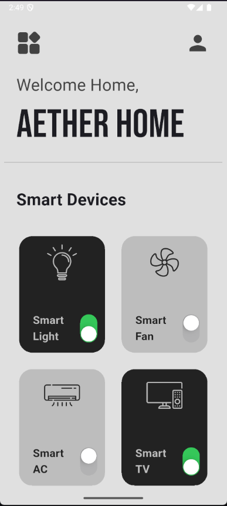

# 🏠 Smart Home App

A simple and interactive Flutter application to manage and monitor your smart home devices. The app allows users to toggle the power state of various smart devices like lights, fans, ACs, and TVs from a beautiful and intuitive UI.

## ✨ Features

- Responsive and modern UI using Flutter's Material Design.
- Toggle switch control for each smart device.
- Grid layout to display smart devices.
- Custom fonts using [Google Fonts](https://pub.dev/packages/google_fonts).
- Easily extendable with more smart devices.

## 📱 Screenshots



## 🛠️ Tech Stack

- **Flutter** (UI toolkit)
- **Dart** (programming language)
- **Google Fonts** (custom typography)
- **Custom Widgets** (e.g., `SmartDeviceBox`)

## 📂 Folder Structure

```
lib/
├── icons/                    # Device icons (e.g., light.png, fan.png)
├── screens/
│   └── home.dart             # Main home page layout and logic
├── widgets/
│   └── smart_device_box.dart # Reusable smart device widget
└── main.dart                 # App entry point
```

## 🚀 Getting Started

1. **Clone the repository:**

```bash
git clone https://github.com/g5277/smart_home_app.git
cd smart_home_app
```

2. **Install dependencies:**

```bash
flutter pub get
```

3. **Run the app:**

```bash
flutter run
```

## 🧩 How It Works

- The app maintains a list of smart devices in a 2D list:  
  `["Device Name", "Icon Path", Power Status]`
- Each device is rendered using the `SmartDeviceBox` widget.
- Toggling the switch updates the power state in real time using `setState`.

## 📦 Dependencies

```yaml
dependencies:
  flutter:
    sdk: flutter
  google_fonts: ^6.1.0
```